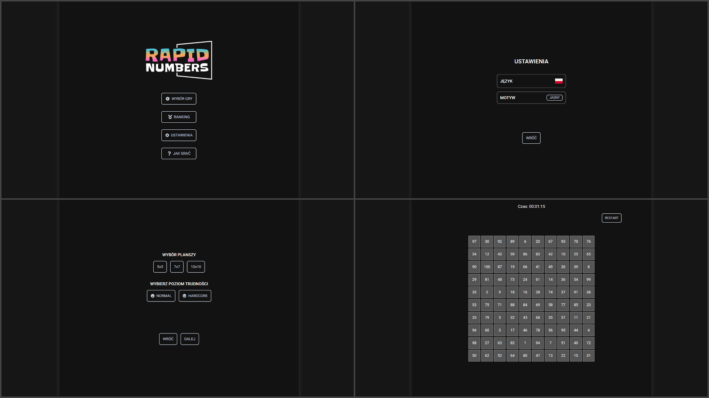

<h3 align="center"> ⚡️ RapidNumbers - increase your speed and focus ⚡️ </h3>

## 1️⃣ Project Overview

-  A simple game based on developing the speed and concentration of
   our mind.<br>
-  It has helped many people from my work to pass psychological
   tests.<br>
-  I am currently works on new features.

## 2️⃣ Technology used

-  
-  
-  
-  
-  

## 3️⃣ Features

-  <strong>Themes:</strong> change the theme of the game between light and dark.
-  <strong>Different board sizes:</strong> you can choose between 5x5, 7x7 or 10x10 board size.
-  <strong>Restart button:</strong> now you can use restart button during the game.

## 4️⃣ Future Enhancements

-  <strong>User Authentication:</strong> implement a login system for users.
-  <strong>Ranking:</strong> add a leaderboard for the best scores.
-  <strong>Translation:</strong> change the language of the interface between English and Polish.
-  <strong>Difficulty level:</strong> add a hardcore level.

## 5️⃣ How to install

1. Clone the project:

```bash
git clone https://github.com/karolhas/rapidnumbers.git
```

2. Go to the project directory:

```bash
cd rapidnumbers
```

3. Install dependencies:

```bash
npm install
```

4. Start the server:

```bash
npm run dev
```

4. Open [http://localhost:3000](http://localhost:3000) with your browser to see the result.

## 6️⃣ Live

📍 Open it in your browser:
https://rapidnumbers.vercel.app/
